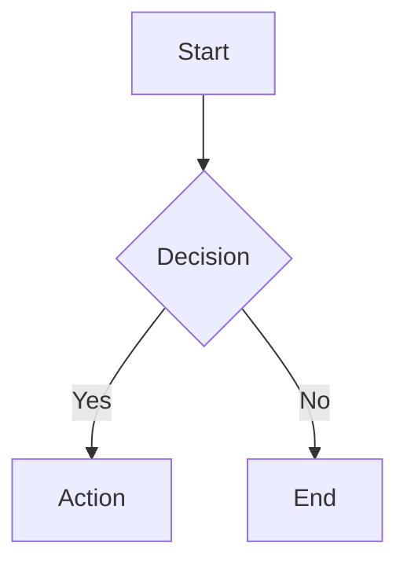

# How to Use Markify

A comprehensive guide to all features and functionality of Markify - your lightweight Markdown viewer with live reload.

---

## Table of Contents

1. [Getting Started](#1-getting-started)
   - [Opening Files](#opening-files)
   - [Opening Folders](#opening-folders)
   - [Recently Opened](#recently-opened)
2. [Navigation](#2-navigation)
   - [File Tree Navigation](#file-tree-navigation)
   - [History Navigation](#history-navigation)
   - [Internal Links](#internal-links)
   - [External Links](#external-links)
3. [Live Reload](#3-live-reload)
4. [Context Menu](#4-context-menu)
   - [Open in File Explorer](#open-in-file-explorer)
   - [Open in Editor](#open-in-editor)
   - [Configure Editors](#configure-editors)
5. [Editor Configuration](#5-editor-configuration)
   - [Configuration File](#configuration-file)
   - [Supported Editors](#supported-editors)
   - [Custom Editor Commands](#custom-editor-commands)
6. [Markdown Features](#6-markdown-features)
   - [GitHub Flavored Markdown](#github-flavored-markdown)
   - [Emoji Support](#emoji-support)
   - [Syntax Highlighting](#syntax-highlighting)
   - [Mermaid Diagrams](#mermaid-diagrams)
7. [Interface Features](#7-interface-features)
   - [Dark Theme](#dark-theme)
   - [Sidebar Toggle](#sidebar-toggle)
   - [Settings Button](#settings-button)
8. [Keyboard Shortcuts](#8-keyboard-shortcuts)
9. [CLI Usage](#9-cli-usage)
10. [Tips & Tricks](#10-tips--tricks)

---

## 1. Getting Started

### Opening Files

There are three ways to open a Markdown file in Markify:

1. **From Welcome Screen**: Click the **"Open File"** button and select a `.md` file
2. **From CLI**: Run `md path/to/file.md` in your terminal
3. **From Recently Opened**: Click any file in the "Recently Opened" section on the welcome screen

### Opening Folders

To browse and navigate multiple Markdown files:

1. Click **"Open Folder"** on the welcome screen
2. Select a directory containing Markdown files
3. Markify will:
   - Display all `.md` files in a file tree sidebar
   - Automatically open `README.md` if it exists
   - Otherwise, open the first `.md` file found

### Recently Opened

The welcome screen shows your **recently opened** files and folders:

- Only shows items you **explicitly opened** via "Open File" or "Open Folder"
- Does **not** track files you navigated to via links or file tree
- Displays in a clean format: **filename** and **parent folder**
- Shows up to **5 most recent items**
- Hover over an item to see the full path
- Click to quickly reopen

---

## 2. Navigation

### File Tree Navigation

When a folder is open, use the **sidebar** to navigate:

- **Click a file** to open it
- **Click a folder** to expand/collapse it
- **Currently open file** is highlighted in blue
- Files are sorted alphabetically with folders first

### History Navigation

Navigate through your browsing history:

- **Previous file**: Click the left arrow (`←`) in the sidebar header
- **Next file**: Click the right arrow (`→`) in the sidebar header
- History tracks all files you've opened in the current session

### Internal Links

Click links to other Markdown files to navigate within the app:

**Supported formats:**
- Relative links: `[Link](./other-file.md)`, `[Link](../folder/file.md)`
- Absolute links: `[Link](/path/to/file.md)`
- Links with anchors: `[Link](file.md#section)`

**Behavior:**
- Opens the file in the same window
- Updates the file tree selection
- Adds to navigation history
- Scrolls to the anchor if specified

### External Links

Links starting with `http://` or `https://` open externally:

- Opens in your **default web browser**
- Opens in a **new window/tab**
- Does not navigate away from Markify
- Indicated by the `target="_blank"` attribute

---

## 3. Live Reload

Markify automatically reloads your Markdown files when they change:

- **Watches the current file** for changes
- **Updates instantly** when you save in your editor
- Shows a **green "Updated at [time]"** indicator in the header
- Works with **all editors** (Vim, VS Code, Cursor, etc.)
- Uses **chokidar** for reliable cross-platform file watching

**Perfect for:**
- Writing and previewing simultaneously
- Seeing changes in real-time
- Iterating on documentation
- Testing Markdown rendering

---

## 4. Context Menu

Right-click any file in the **file tree** to access quick actions:

### Open in File Explorer

- Opens your system file manager (Finder on macOS)
- Highlights the selected file
- Useful for managing files outside Markify

### Open in Editor

Click **"Open in..."** to see a submenu of available editors:

- Shows all **detected editors** on your system
- **System Default**: Opens with your OS default app
- **VS Code**: Opens in Visual Studio Code
- **Cursor**: Opens in Cursor editor
- **Vim/Neovim**: Opens in Terminal with vim
- And more...

**Line number support:**
- Editors like VS Code and Cursor will jump to the cursor position from Neovim metadata

### Configure Editors

Click **"Configure Editors..."** to:

- Open the `markify-config.json` file
- Customize editor commands
- Add new editors
- Modify keyboard shortcuts

---

## 5. Editor Configuration

### Configuration File

Markify stores editor settings in `markify-config.json`:

**Location:**
- **macOS**: `~/Library/Application Support/Markify/markify-config.json`
- **Windows**: `%APPDATA%/Markify/markify-config.json`
- **Linux**: `~/.config/Markify/markify-config.json`

**Access:**
1. Click the **settings button** (⚙️) in the top-right of the welcome screen
2. Or click **"Configure Editors..."** in the context menu
3. Or from the header when viewing a file

### Supported Editors

Default configuration includes:

```json
{
  "version": "1.0",
  "editor": {
    "type": "system",
    "supportLineNumbers": true
  },
  "editorPresets": {
    "vim": {
      "command": "vim",
      "args": ["+{line}", "{file}"],
      "terminal": true,
      "name": "Vim"
    },
    "nvim": {
      "command": "nvim",
      "args": ["+{line}", "{file}"],
      "terminal": true,
      "name": "Neovim"
    },
    "vscode": {
      "command": "code",
      "args": ["--goto", "{file}:{line}"],
      "terminal": false,
      "name": "VS Code"
    },
    "cursor": {
      "command": "cursor",
      "args": ["--goto", "{file}:{line}"],
      "terminal": false,
      "name": "Cursor"
    },
    "system": {
      "useShell": true,
      "name": "System Default"
    }
  }
}
```

### Custom Editor Commands

Add your own editor:

```json
{
  "editorPresets": {
    "sublime": {
      "command": "subl",
      "args": ["{file}:{line}"],
      "terminal": false,
      "name": "Sublime Text"
    }
  }
}
```

**Placeholders:**
- `{file}`: Full path to the file
- `{line}`: Line number (defaults to 1)

**Properties:**
- `command`: The executable name or path
- `args`: Array of command-line arguments
- `terminal`: Whether to open in a terminal (for vim/nvim)
- `name`: Display name in the menu
- `platform`: (Optional) Platform restriction (e.g., "win32")

---

## 6. Markdown Features

### GitHub Flavored Markdown

Full support for GFM extensions:

**Tables:**
```markdown
| Feature | Supported |
|---------|-----------|
| Tables  | ✓         |
| Tasks   | ✓         |
```

**Task Lists:**
```markdown
- [x] Completed task
- [ ] Pending task
```

**Strikethrough:**
```markdown
~~deleted text~~
```

**Autolinks:**
```markdown
https://example.com
user@example.com
```

### Emoji Support

Use emoji shortcodes:

```markdown
:rocket: :tada: :heart: :fire:
```

Renders as: 🚀 🎉 ❤️ 🔥

### Syntax Highlighting

Code blocks are automatically highlighted:

````markdown
```javascript
function hello() {
  console.log('Hello, World!');
}
```
````

**Supported languages:**
- JavaScript, TypeScript, Python, Java, C, C++, C#
- HTML, CSS, SCSS, JSON, YAML, XML
- Bash, Shell, PowerShell
- Markdown, SQL, Go, Rust, Ruby, PHP
- And many more...

### Mermaid Diagrams

Create diagrams using Mermaid syntax:

````markdown

````

**Supported diagram types:**
- Flowcharts (`graph TD`, `graph LR`)
- Sequence diagrams (`sequenceDiagram`)
- Class diagrams (`classDiagram`)
- State diagrams (`stateDiagram-v2`)
- Gantt charts (`gantt`)
- Pie charts (`pie`)
- Git graphs (`gitGraph`)
- Entity Relationship diagrams (`erDiagram`)

See `mermaid-example.md` for more examples.

---

## 7. Interface Features

### Dark Theme

Markify features a beautiful dark theme optimized for readability:

- **Background**: Dark gray (`#1e1e1e`)
- **Text**: Light gray (`#d4d4d4`)
- **Accent**: Blue (`#58a6ff`)
- **Code blocks**: Syntax highlighted with dark theme
- **Consistent styling** across all UI elements

### Sidebar Toggle

Control the file tree sidebar:

- **Toggle button** (☰) in the top-left corner
- Click to **show/hide** the sidebar
- Sidebar state is **remembered** during the session
- When closed, content expands to full width

### Settings Button

Quick access to configuration:

- **Gear icon** (⚙️) in the header when viewing files
- **Gear icon** in top-right of welcome screen
- Opens `markify-config.json` in your default editor

---

## 8. Keyboard Shortcuts

Currently, Markify focuses on mouse/trackpad interaction. Keyboard shortcuts coming soon!

**Workaround for power users:**
- Set up editor shortcuts (e.g., in Neovim) to open files in Markify
- Use the CLI for quick file opening

---

## 9. CLI Usage

### Basic Usage

```bash
# Open a single file
md path/to/file.md

# Open a file with relative path
md ./README.md

# Open a file with absolute path
md /Users/username/Documents/file.md
```

### Development Mode

```bash
# Run in development mode with DevTools
npm run dev

# Build and run
npm run webpack
npm start
```

### Global Installation

```bash
# Install globally
npm link

# Now use 'md' from anywhere
md ~/Documents/my-file.md
```

### Neovim Integration

Add to your `init.vim`:
```vim
nnoremap <leader>mp :!md %<CR>
```

Or `init.lua`:
```lua
vim.keymap.set('n', '<leader>mp', ':!md %<CR>', { desc = 'Markdown Preview' })
```

---

## 10. Tips & Tricks

### Organizing Documentation

1. Create a `README.md` in your project root
2. Use relative links to other documentation files
3. Open the folder in Markify to navigate easily
4. Markify automatically opens `README.md`

### Working with Multiple Files

1. Open a folder containing all your Markdown files
2. Use the file tree to switch between files
3. Use back/forward navigation to return to previous files
4. Links between files work automatically

### Editing Workflow

1. Open your Markdown file in Markify
2. Right-click the file in the sidebar
3. Select "Open in..." → Your preferred editor
4. Edit and save - changes appear instantly in Markify
5. Perfect dual-monitor setup!

### Customizing Editors

1. Open the settings (⚙️ button)
2. Add custom editor configurations
3. Set your preferred default editor
4. Configure line number support for your workflow

### Quick File Access

1. Recently opened items are always on the welcome screen
2. Use "Exit Preview" to return to the welcome screen
3. Click any recent item to quickly reopen
4. Works for both files and folders

### Mermaid Diagrams

1. Use Mermaid for architecture diagrams, flowcharts, etc.
2. Preview updates in real-time as you edit
3. Export your Markdown with diagrams to HTML or PDF
4. Share rendered diagrams with your team

---

## Need Help?

- **Issues**: Report bugs at [GitHub Issues](https://github.com/AllefDouglasDev/markdown-viewer/issues)
- **Documentation**: Check the main [README.md](./README.md)
- **Configuration**: See the [CLAUDE.md](./CLAUDE.md) for technical details

---

**Enjoy using Markify!** 🚀
