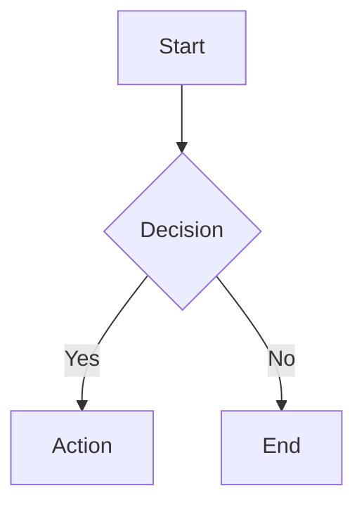

# Markdown Renderer - Electron App

Aplicação Electron para renderizar arquivos Markdown em uma janela nativa, acessível via linha de comando.

## Tecnologias

- **Electron**: Framework para aplicações desktop
- **React**: Biblioteca para UI
- **react-markdown**: Renderização de Markdown com suporte a plugins
- **remark-gfm**: GitHub Flavored Markdown
- **remark-gemoji**: Suporte a emojis com shortcodes
- **rehype-highlight**: Syntax highlighting para código
- **Mermaid**: Renderização de diagramas e gráficos

## Instalação

```bash
npm install
```

## Uso

### Pré-requisito: Build do Webpack

Antes de usar a aplicação, compile o código React:

```bash
npm run webpack
```

### Modo 1: Teste Rápido

```bash
npm test
# Ou diretamente:
npm start example.md
```

### Modo 2: CLI Wrapper

```bash
./bin/md example.md
```

### Modo 3: Instalação Global

```bash
npm link
md /caminho/para/arquivo.md
```

### Modo Desenvolvimento (com Hot Reload)

**Terminal 1** - Webpack Dev Server:
```bash
npm run webpack:watch
```

**Terminal 2** - Electron:
```bash
npm run dev example.md
```

**Importante:** O modo dev (`--dev` flag) tenta carregar de `localhost:8080`. Use apenas se estiver rodando o webpack-dev-server.

## Troubleshooting

### Janela não aparece

1. Verifique se você está executando **localmente** (não via SSH)
2. Certifique-se de que compilou o webpack: `npm run webpack`
3. Teste com: `npm test`
4. Verifique os logs no terminal

### Erro "Cannot find module"

Execute `npm install` novamente.

### Tela branca

1. Abra o DevTools (menu View → Toggle Developer Tools)
2. Verifique erros no console
3. Certifique-se de que `dist/bundle.js` existe

## Estrutura do Projeto

```
markdown/
├── bin/
│   └── md                   # CLI script
├── src/
│   ├── main/
│   │   ├── index.js         # Electron main process
│   │   └── preload.js       # Preload script (IPC bridge)
│   └── renderer/
│       ├── index.html       # HTML template (Mermaid CDN)
│       ├── index.jsx        # React entry point
│       ├── App.jsx          # Main React component
│       ├── MermaidChart.jsx # Componente de diagramas Mermaid
│       └── styles.css       # Styles
├── webpack.config.js        # Webpack configuration
└── package.json
```

## Funcionalidades

- ✅ Renderização de Markdown com GitHub Flavored Markdown
- ✅ Syntax highlighting para blocos de código
- ✅ Live reload (atualiza automaticamente quando o arquivo muda)
- ✅ Suporte a emojis (`:rocket:` → 🚀)
- ✅ **Diagramas Mermaid** (flowcharts, diagramas de sequência, diagramas de classe, Gantt, etc.)
- ✅ Tema dark mode
- ✅ Suporte a tabelas, listas, task lists, links, imagens
- ✅ Comando CLI para abrir arquivos
- ✅ Indicador visual de atualização

## Diagramas Mermaid

Para criar diagramas Mermaid, use um bloco de código com a linguagem `mermaid`:

~~~markdown

~~~

### Tipos de Diagramas Suportados

- **Flowcharts**: Diagramas de fluxo (`graph TD`, `graph LR`)
- **Sequence Diagrams**: Diagramas de sequência (`sequenceDiagram`)
- **Class Diagrams**: Diagramas de classe (`classDiagram`)
- **State Diagrams**: Diagramas de estado (`stateDiagram-v2`)
- **Gantt Charts**: Gráficos de Gantt (`gantt`)
- **Pie Charts**: Gráficos de pizza (`pie`)
- **Git Graphs**: Gráficos Git (`gitGraph`)
- **ER Diagrams**: Diagramas entidade-relacionamento (`erDiagram`)

Veja exemplos completos em `mermaid-example.md`.

## Build e Distribuição

### Gerar Executáveis

O aplicativo usa `electron-builder` para criar executáveis distribuíveis:

```bash
# Build para a plataforma atual
npm run build

# Build específico por plataforma
npm run build:mac    # macOS (.dmg e .zip)
npm run build:win    # Windows (.exe e portable)
npm run build:linux  # Linux (.AppImage e .deb)

# Build para todas as plataformas (requer configuração adicional)
npm run build:all
```

Os executáveis serão gerados na pasta `release/`.

### Sistema de Atualização Automática

O aplicativo inclui atualização automática via GitHub Releases:

1. **Publicação de Releases**: Use `npm run release` para fazer build e publicar
2. **Verificação Automática**: O app verifica atualizações ao iniciar (após 3 segundos)
3. **Download Manual**: Usuário decide se quer baixar a atualização
4. **Instalação**: Após download, usuário decide quando reiniciar para aplicar

**Requisitos para Auto-Update:**
- Releases publicados no GitHub
- Token de acesso configurado (`GH_TOKEN` env var)
- App assinado digitalmente (macOS/Windows para distribuição pública)

### Ícones do Aplicativo

Coloque os ícones na pasta `build/`:
- `icon.icns` - macOS (1024x1024px)
- `icon.ico` - Windows (256x256px)
- `icon.png` - Linux (512x512px ou maior)

Veja `build/README.md` para mais detalhes sobre geração de ícones.

## Integração com Neovim

Adicione ao seu `init.vim` ou `init.lua`:

```vim
" Abrir preview do Markdown
nnoremap <leader>mp :!md %<CR>
```

Ou em Lua:

```lua
vim.keymap.set('n', '<leader>mp', ':!md %<CR>', { desc = 'Markdown Preview' })
```

## Versionamento

O aplicativo segue [Semantic Versioning](https://semver.org/):
- **Major**: Mudanças incompatíveis na API
- **Minor**: Novas funcionalidades compatíveis
- **Patch**: Correções de bugs

Versão atual: **1.0.0**
