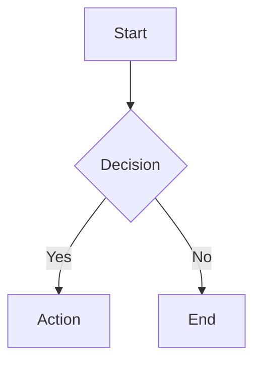
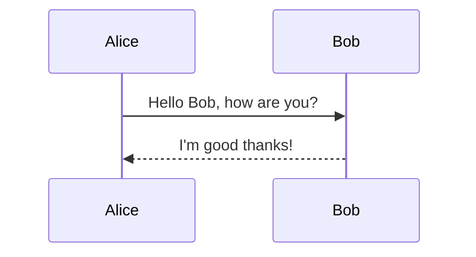
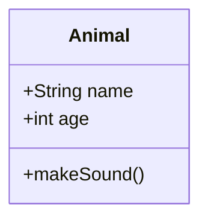
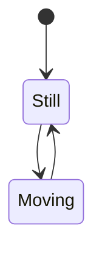
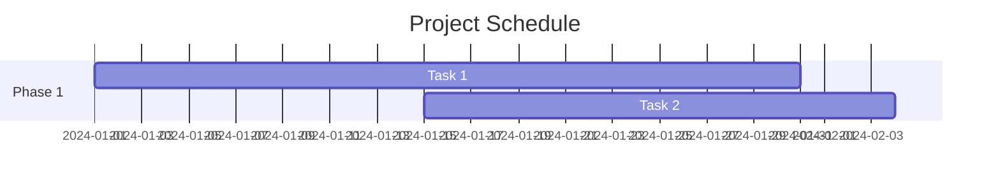

# Markdown Features

Full support for GitHub Flavored Markdown (GFM) with emoji, syntax highlighting, and Mermaid diagrams.

---

## GitHub Flavored Markdown

Markify uses `remark-gfm` for complete GFM support.

### Tables

```markdown
| Feature | Supported | Notes |
|---------|:---------:|-------|
| Tables  | ✓         | Full support |
| Alignment | ✓       | Left, center, right |
| Header rows | ✓     | Required |
```

**Renders as:**

| Feature | Supported | Notes |
|---------|:---------:|-------|
| Tables  | ✓         | Full support |
| Alignment | ✓       | Left, center, right |
| Header rows | ✓     | Required |

**Alignment:**
- `:---` - Left align (default)
- `:---:` - Center align
- `---:` - Right align

### Task Lists

```markdown
- [x] Completed task
- [ ] Pending task
- [ ] Another task
  - [x] Nested completed
  - [ ] Nested pending
```

**Renders as:**

- [x] Completed task
- [ ] Pending task
- [ ] Another task
  - [x] Nested completed
  - [ ] Nested pending

### Strikethrough

```markdown
~~This text is deleted~~
This text is normal
```

**Renders as:**

~~This text is deleted~~
This text is normal

### Autolinks

URLs and emails are automatically converted to links:

```markdown
https://github.com
user@example.com
```

---

## Emoji Support

Use emoji shortcodes powered by `remark-gemoji`.

### Syntax:

```markdown
:rocket: :tada: :heart: :fire: :star:
```

**Renders as:**

🚀 🎉 ❤️ 🔥 ⭐

### Popular Emojis:

| Shortcode | Emoji | Shortcode | Emoji |
|-----------|-------|-----------|-------|
| `:smile:` | 😄 | `:+1:` | 👍 |
| `:rocket:` | 🚀 | `:tada:` | 🎉 |
| `:heart:` | ❤️ | `:fire:` | 🔥 |
| `:star:` | ⭐ | `:check:` | ✅ |
| `:x:` | ❌ | `:warning:` | ⚠️ |

**Full list:** See the [emoji cheat sheet](https://github.com/ikatyang/emoji-cheat-sheet)

---

## Syntax Highlighting

Code blocks are highlighted with `rehype-highlight`.

### Basic Usage:

````markdown
```javascript
function hello() {
  console.log('Hello, World!');
}
```
````

### Supported Languages:

**Web:**
- javascript, typescript, jsx, tsx
- html, css, scss, less
- json, yaml, xml

**Backend:**
- python, java, go, rust
- php, ruby, perl
- c, cpp, csharp
- sql

**Shell:**
- bash, shell, sh
- powershell, batch
- zsh, fish

**Others:**
- markdown, text
- diff, patch
- dockerfile
- makefile

**And 100+ more languages!**

### Inline Code:

```markdown
Use `const` instead of `var` in JavaScript.
```

**Renders as:**

Use `const` instead of `var` in JavaScript.

---

## Mermaid Diagrams

Create beautiful diagrams with Mermaid syntax.

### Flowcharts:

````markdown

````

### Sequence Diagrams:

````markdown

````

### Class Diagrams:

````markdown

````

### State Diagrams:

````markdown

````

### Gantt Charts:

````markdown

````

**See full examples in the mermaid-example.md file.**

---

## Standard Markdown

All standard Markdown features are supported:

### Headings:

```markdown
# Heading 1
## Heading 2
### Heading 3
#### Heading 4
##### Heading 5
###### Heading 6
```

### Emphasis:

```markdown
*italic* or _italic_
**bold** or __bold__
***bold italic*** or ___bold italic___
```

### Lists:

```markdown
- Unordered list
- Item 2
  - Nested item

1. Ordered list
2. Item 2
   1. Nested item
```

### Links:

```markdown
[Link text](https://example.com)
[Link with title](https://example.com "Title")
```

### Images:

```markdown


```

### Blockquotes:

```markdown
> This is a quote
> Multiple lines
>
> > Nested quote
```

### Horizontal Rules:

```markdown
---
***
___
```

### Code Blocks:

````markdown
```
Code block without language
```

```python
# Code block with language
print("Hello")
```
````

---

## Next Steps

- Learn about [Interface Features](./interface.md)
- Explore [Live Reload](./live-reload.md)
- Check out [Tips & Tricks](./tips-and-tricks.md)

---

[← Back to Documentation Index](./README.md)
