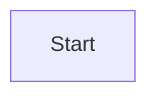
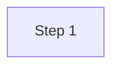

# Tips & Tricks

Pro tips and best practices for getting the most out of Markify.

---

## Organizing Documentation

### Create a Main Index

**Best practice:** Use `README.md` as your documentation entry point.

```markdown
# Project Documentation

## Quick Start
- [Installation](./installation.md)
- [Configuration](./configuration.md)
- [Usage Guide](./usage.md)

## API Reference
- [REST API](./api/rest.md)
- [GraphQL API](./api/graphql.md)

## Development
- [Contributing](./CONTRIBUTING.md)
- [Architecture](./architecture.md)
```

### Recommended Structure:

```
project/
├── README.md              # Main entry point
├── docs/
│   ├── getting-started.md
│   ├── guides/
│   │   ├── installation.md
│   │   └── configuration.md
│   ├── api/
│   │   ├── README.md      # API index
│   │   ├── rest.md
│   │   └── graphql.md
│   └── advanced/
│       └── performance.md
└── CONTRIBUTING.md
```

**Benefits:**
- Markify auto-opens `README.md`
- Clear navigation hierarchy
- Easy to maintain
- Portable (works on GitHub too)

---

## Working with Multiple Files

### Navigation Patterns:

**1. Hub and Spoke:**
```
README.md (hub)
  ├─> feature-a.md
  ├─> feature-b.md
  └─> feature-c.md
```

**2. Sequential:**
```
chapter-1.md → chapter-2.md → chapter-3.md
```

**3. Hierarchical:**
```
index.md
  └─> category-a/
      ├─> topic-1.md
      └─> topic-2.md
```

### Linking Tips:

**Use relative links:**
```markdown
[Installation](./guides/installation.md)  ✓ Good
[Installation](/full/path/installation.md) ✗ Bad
```

**Add navigation aids:**
```markdown
---
[← Back to Index](./README.md) | [Next: Configuration →](./configuration.md)
---
```

**Table of contents:**
```markdown
## Table of Contents

- [Section 1](#section-1)
- [Section 2](#section-2)
  - [Subsection 2.1](#subsection-21)
```

---

## Dual-Monitor Workflow

### Optimal Setup:

**Monitor 1 (Left):** Editor at 60-70% width
- VS Code / Vim / Cursor
- Write and edit Markdown
- Full keyboard access

**Monitor 2 (Right):** Markify at full screen
- Live preview
- Auto-updates on save
- Read-only view

### Single Monitor Alternative:

**Split Screen:**
```
┌──────────┬─────────┐
│          │         │
│  Editor  │ Markify │
│   60%    │   40%   │
│          │         │
└──────────┴─────────┘
```

**Virtual Desktops:**
- Desktop 1: Editor (full screen)
- Desktop 2: Markify (full screen)
- Swipe between them (macOS: 3-finger swipe)

---

## Editing Workflow

### The Perfect Loop:

1. **Open folder** in Markify
2. **Browse files** in file tree
3. **Right-click** → "Open in Editor"
4. **Edit and save** (enable auto-save for best experience)
5. **Watch changes** appear instantly in Markify
6. **Navigate via links** to related files
7. **Repeat**

### Keyboard Optimization:

**Editor shortcuts:**
```
Cmd/Ctrl + S       Save file (see update in Markify)
Cmd/Ctrl + P       Quick open another file
Cmd/Ctrl + Tab     Switch between open files
```

**System shortcuts:**
```
Cmd/Ctrl + Tab     Switch to Markify
Cmd + `            Switch between app windows (macOS)
```

---

## Working with Mermaid Diagrams

### Live Preview Workflow:

1. **Create Mermaid block:**
````markdown

````

2. **Save file** → See diagram instantly
3. **Edit and save** → See updates in real-time
4. **Iterate** until perfect

### Diagram Tips:

**Test incrementally:**


**Use comments:**


**Reference the docs:**
- Keep [Mermaid docs](https://mermaid.js.org/) open
- Test examples in Markify
- Build complex diagrams step by step

### Common Diagrams:

**Architecture:**


**Workflow:**


**Timeline:**


---

## Quick File Access

### Recently Opened:

**Best practices:**
- **Open folders** for projects you're actively working on
- **Open specific files** for quick reference docs
- **Use the welcome screen** as a dashboard
- **Limit to 5 items** (keeps it clean)

### Favorites (Workaround):

Since Markify doesn't have favorites yet, use shell aliases:

```bash
# In ~/.bashrc or ~/.zshrc
alias mddocs='md ~/Documents/project/docs'
alias mdnotes='md ~/Notes/README.md'
alias mdtodo='md ~/TODO.md'
```

---

## Customizing for Your Workflow

### Editor Integration:

**Set your preferred editor:**

Edit `markify-config.json`:
```json
{
  "editor": {
    "type": "vscode",  // or "nvim", "cursor", etc.
    "supportLineNumbers": true
  }
}
```

**Add project-specific editors:**
```json
{
  "editorPresets": {
    "project-ide": {
      "command": "/Applications/MyIDE.app/Contents/MacOS/MyIDE",
      "args": ["{file}:{line}"],
      "name": "Project IDE"
    }
  }
}
```

### Shell Functions:

**Open project docs:**
```bash
# Open project documentation
docs() {
  local docs_dir="./docs"
  local readme="$docs_dir/README.md"

  if [ -f "$readme" ]; then
    md "$readme"
  else
    echo "Error: No docs found"
  fi
}
```

**Open with automatic folder detection:**
```bash
# Smart open: file or folder
mdopen() {
  if [ -f "$1" ]; then
    md "$1"
  elif [ -d "$1" ]; then
    local readme="$1/README.md"
    if [ -f "$readme" ]; then
      md "$readme"
    else
      echo "Error: No README.md in $1"
    fi
  else
    echo "Error: $1 not found"
  fi
}
```

---

## Performance Tips

### Large Files:

**Avoid:**
- Files over 10MB
- Extremely long files (>10,000 lines)
- Huge embedded images

**Instead:**
- Split into multiple files
- Link between files
- Use external image hosting
- Optimize images before embedding

### Many Files:

**Efficient navigation:**
- Collapse unused folders
- Use search (coming soon)
- Organize into subdirectories
- Keep working set small

### Live Reload:

**Optimal settings:**
- Enable editor auto-save
- Use 1-2 second delay
- Don't save every keystroke
- Let debounce work

---

## Documentation Best Practices

### Writing Style:

**Clear structure:**
```markdown
# Main Topic

Brief introduction.

## Section 1
Content...

## Section 2
Content...
```

**Use headings wisely:**
- H1 for page title (only one)
- H2 for main sections
- H3 for subsections
- H4+ sparingly

**Visual hierarchy:**
- **Bold** for emphasis
- *Italic* for subtle emphasis
- `code` for technical terms
- > Blockquotes for notes

### Linking Strategy:

**Internal links:**
- Use relative paths
- Link to related topics
- Add "See also" sections
- Include back links

**External links:**
- Open in browser (automatic)
- Use for references
- Add context in link text
- Consider link rot

### Code Examples:

**Always specify language:**
````markdown
```javascript
// Good
const x = 42;
```

```
// Bad (no language)
const x = 42;
```
````

**Include context:**
```markdown
Install dependencies:
```bash
npm install
```

Then run:
```bash
npm start
```
```

---

## Collaboration

### Team Workflows:

**1. Shared Documentation Repo:**
```bash
# Clone team docs
git clone git@github.com:team/docs.git
cd docs

# Open in Markify
md README.md

# Edit, commit, push
vim guide.md
git add guide.md
git commit -m "Update guide"
git push
```

**2. Review Process:**
- Open PR with doc changes
- Share Markify screenshots
- Review rendered output
- Merge when approved

**3. Documentation as Code:**
- Keep docs in same repo as code
- Update docs with code changes
- Review in Markify before commit
- Automate validation

### Style Guides:

**Maintain consistency:**
- Agree on heading styles
- Use consistent terminology
- Follow naming conventions
- Document your style guide

**Example style guide:**
```markdown
# Documentation Style Guide

## Headings
- Use sentence case
- H1 once per page
- H2 for main sections

## Code
- Always specify language
- Include comments
- Show expected output

## Links
- Use descriptive text
- Prefer relative links
- Check links regularly
```

---

## Troubleshooting Common Issues

### Files Not Updating?

**Checklist:**
1. Did you **save** the file?
2. Is Markify watching the **right file**?
3. Does your editor create **backup files**?
4. Try **restarting** Markify

### Broken Links?

**Debug steps:**
1. **Check path** (relative vs absolute)
2. **Check case** (filename.md vs FileName.md)
3. **Check existence** (file moved/renamed?)
4. **Test in Markify** (click the link)

### Slow Performance?

**Solutions:**
1. **Split large files** (>1MB)
2. **Optimize images** (compress before embedding)
3. **Reduce complexity** (limit nested diagrams)
4. **Close unused** files/folders

---

## Advanced Tricks

### Custom CSS (Future Feature):

While not yet supported, this is planned:

```markdown
<!-- In your Markdown file -->
<style>
.custom-class {
  color: #ff6600;
  font-size: 20px;
}
</style>

<div class="custom-class">
  Custom styled content
</div>
```

### Embedded HTML:

**Works now:**
```markdown
<details>
<summary>Click to expand</summary>

Hidden content here!
</details>
```

**Tables with custom alignment:**
```html
<table>
  <tr>
    <th style="width: 30%">Column 1</th>
    <th style="width: 70%">Column 2</th>
  </tr>
  <tr>
    <td>Data 1</td>
    <td>Data 2</td>
  </tr>
</table>
```

### Emoji Tricks:

**Use sparingly for visual markers:**
```markdown
## 🚀 Getting Started
## ⚙️ Configuration
## 📚 Reference
## 🐛 Troubleshooting
```

**Status indicators:**
```markdown
- ✅ Implemented
- ⏳ In progress
- ❌ Not started
- 🚧 Blocked
```

---

## What's Next?

### Feature Requests:

Have an idea? Check if it's already requested:
- [GitHub Issues](https://github.com/AllefDouglasDev/markdown-viewer/issues)
- Tag: `enhancement`
- Vote with 👍 reactions

### Learning More:

- [Markdown Guide](https://www.markdownguide.org/)
- [Mermaid Documentation](https://mermaid.js.org/)
- [GitHub Flavored Markdown](https://github.github.com/gfm/)

---

## Keep Exploring!

**Documentation:**
- [Getting Started](./getting-started.md)
- [Navigation](./navigation.md)
- [Editor Configuration](./editor-configuration.md)

**More help:**
- [GitHub Discussions](https://github.com/AllefDouglasDev/markdown-viewer/discussions)
- [Report Issues](https://github.com/AllefDouglasDev/markdown-viewer/issues)

---

[← Back to Documentation Index](./README.md)
