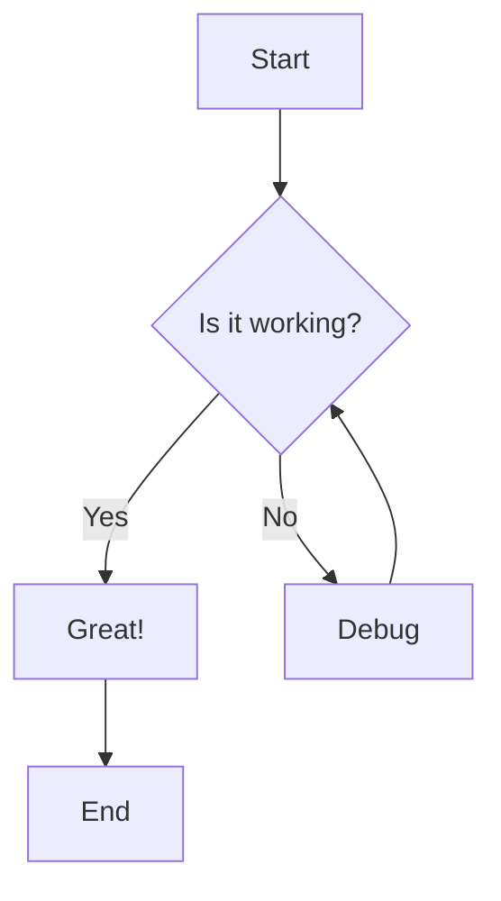
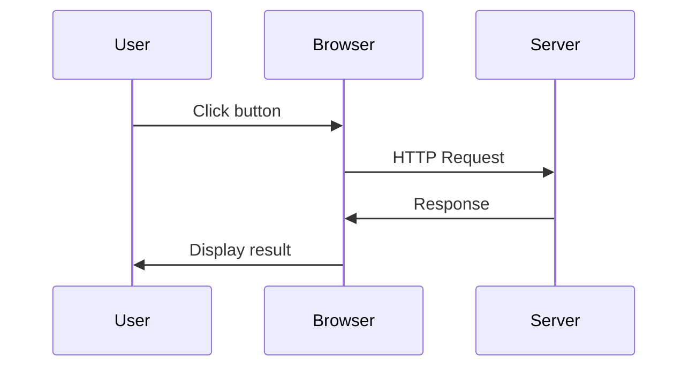
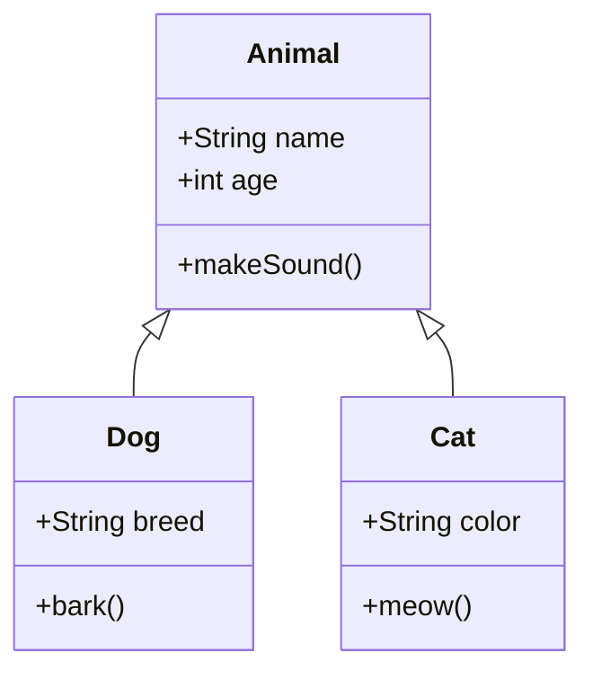
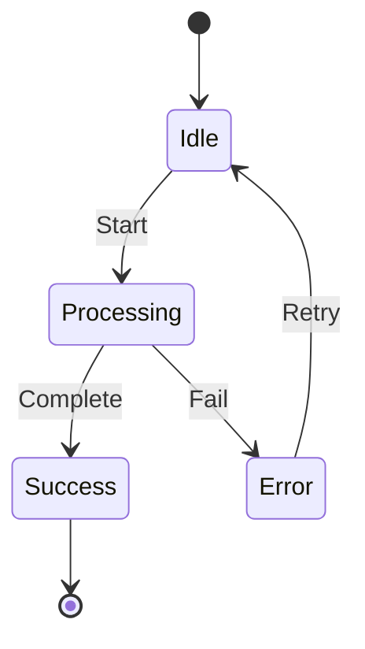
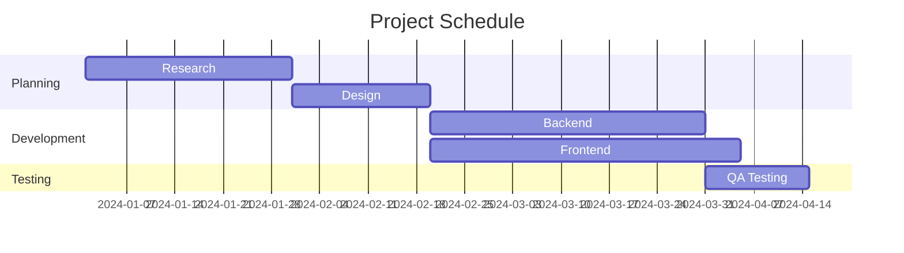
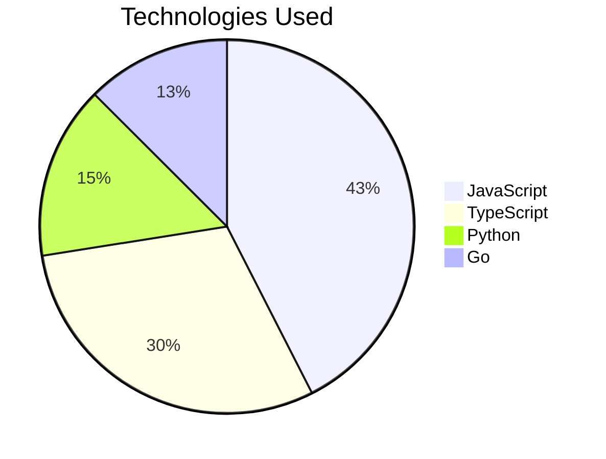
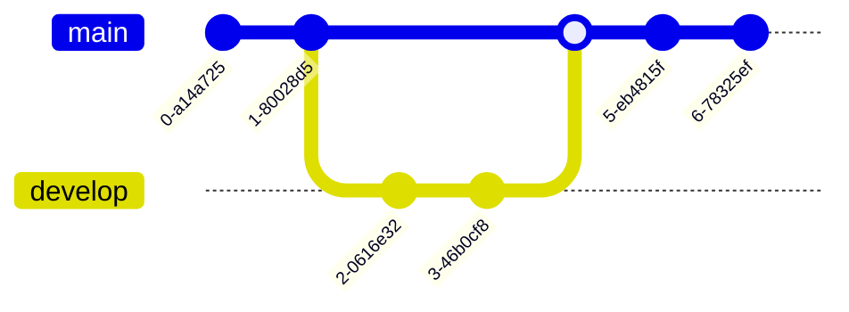
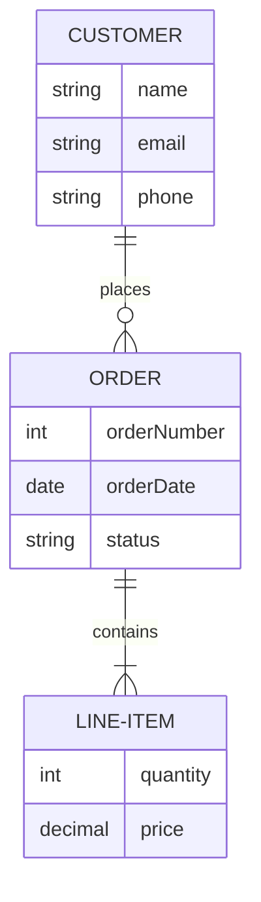

# Mermaid Diagram Examples

## Flowchart



## Sequence Diagram



## Class Diagram



## State Diagram



## Gantt Chart



## Pie Chart



## Git Graph



## Entity Relationship Diagram



## Normal Code Block (for comparison)

```javascript
function hello() {
  console.log('This is regular code, not a diagram');
}
```
